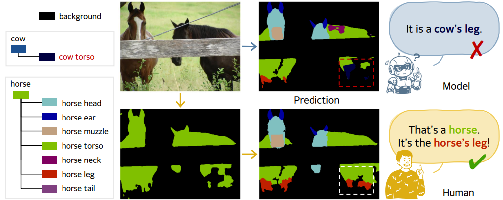
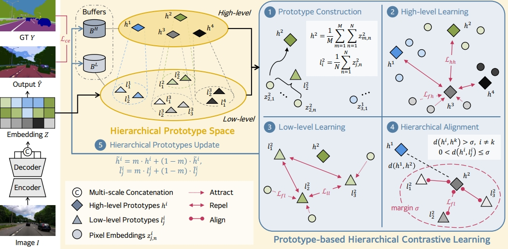

# HiPoSeg 🦛: Hierarchical Prototype Learning for Semantic Segmentation
**The Fourteenth International Conference on Learning Representations (ICLR) 2026**

[Project Page](https://iclr.cc/virtual/2026/poster/10006745) | [Paper](https://openreview.net/forum?id=wHMuQ9HgUo) | [Contact](https://seoha815.github.io/)

<p align="center">
  
</p>

**Hierarchical Prototype Learning for Semantic Segmentation**
The Fourteenth International Conference on Learning Representations (ICLR) 2026

Seoha Lim*, Jinmyeong Kim*, Jieun Kim, Sung-Bae Cho  
Yonsei University  
{seoha815, jmkim_, lilly9928, sbcho}@yonsei.ac.kr

## 💡 Abstract

Conventional semantic segmentation methods often fail to distinguish fine-grained parts within the same object because of missing links between part-level cues and object-level semantics. Inspired by how humans recognize objects, which involves first identifying them as a whole and then distinguishing their parts, we propose a hierarchical prototype-based segmentation method called Hierarchical Prototype Segmentation (HiPoSeg). This builds a structured prototype space that captures both abstract object-level representations and detailed part-level features, enabling consistent alignment between levels. HiPoSeg leverages a hierarchical contrastive learning strategy to structure semantic representations across levels, encouraging both intra-level discrimination and cross-level consistency. Experiments on standard benchmarks such as Cityscapes, ADE20K, Mapillary Vistas 2.0, and PASCAL-Part-108 demonstrate that HiPoSeg produces consistent performance improvement with an average gain of +3.07%p mIoU without any additional inference cost.

<p align="center">
  
</p>

Overview of HiPoSeg, composed of (1) prototype construction: pixel features are grouped by low-level labels and their corresponding high-level mappings to initialize both low- and high-level prototypes, (2) high-level learning: pixel features are pulled toward their high-level prototypes that are enforced to be mutually separated, (3) low-level learning: after high-level convergence, low-level discrimination is refined using the same pull–push mechanism, and (4) hierarchical alignment: each low-level prototype is constrained to remain close to its parent high-level prototype while preserving separation between different high-level groups.

## 🔎 Results

<p align="center">
  
</p>

<p align="center">
  
</p>

<p align="center">
  
</p>

## 💻 Code

Code will be released soon.

## 📌 Citation

If you find **HiPoSeg** useful in your research, please consider citing:

```bibtex
@inproceedings{limhierarchical,
  title={Hierarchical Prototype Learning for Semantic Segmentation},
  author={Lim, Seoha and Kim, Jinmyeong and Kim, Jieun and Cho, Sung-Bae},
  booktitle={The Fourteenth International Conference on Learning Representations}
}
